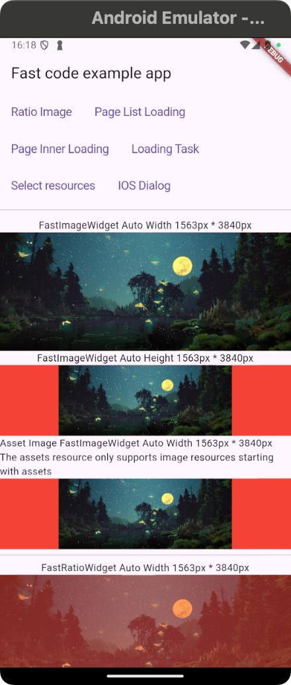
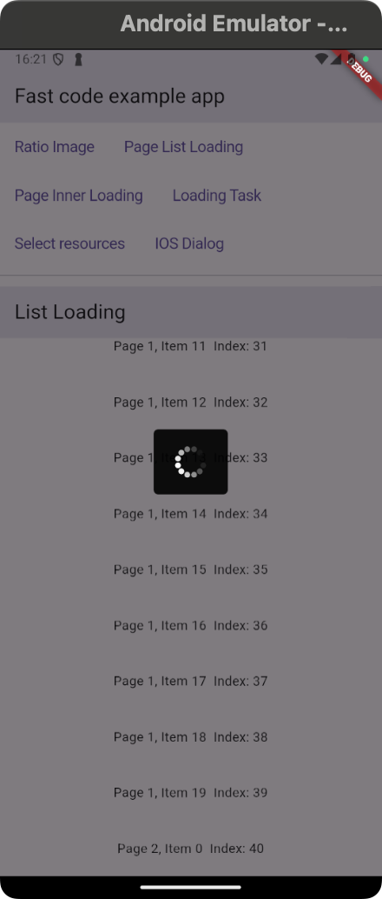
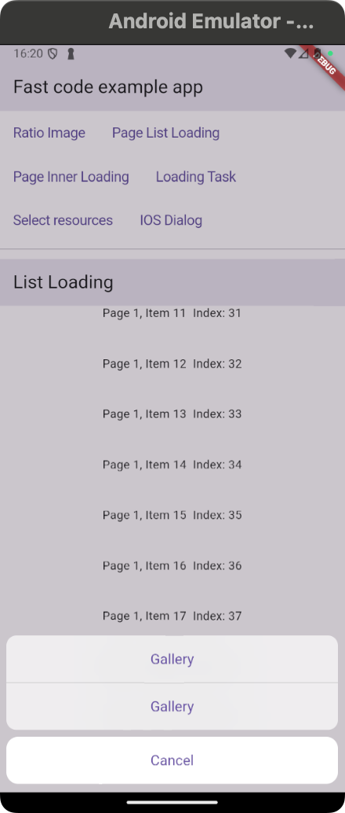
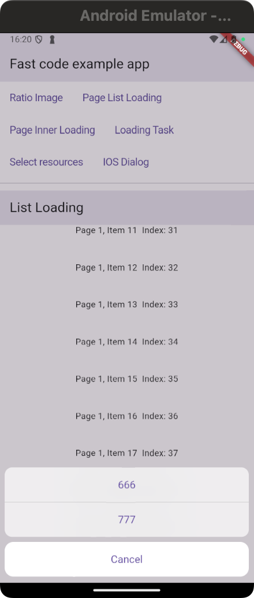
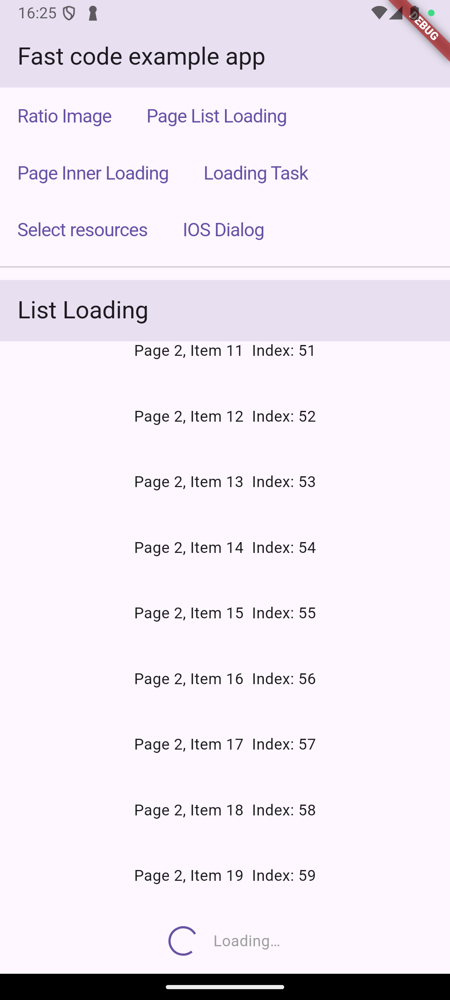
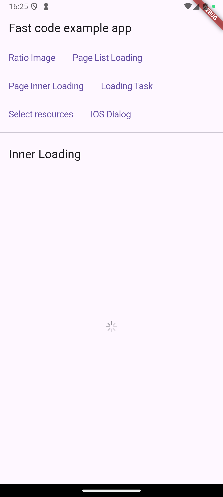

# Fast Code Example App

This example demonstrates how to use the `fast_code` package along with various other Flutter components like `flutter_easyloading` for task management and loading indicators.

## Getting Started

To use the `fast_code` package, follow these steps:

1. Install the dependencies:

   Add these dependencies to your `pubspec.yaml` file:

   ```yaml
   dependencies:
     fast_code: latest_version
     flutter_easyloading: latest_version
   ```

2. Import the necessary libraries in your Dart file:

   ```dart
   import 'package:fast_code/fast_code.dart';
   import 'package:flutter/cupertino.dart';
   import 'package:flutter/material.dart';
   import 'dart:async';
   import 'package:flutter_easyloading/flutter_easyloading.dart';
   ```

3. Initialize the `EasyLoading` builder when starting the app:

   ```dart
   void main() {
     runApp(MaterialApp(
       home: MyApp(),
       builder: EasyLoading.init(),
     ));
   }
   ```

## Features

### 1. Ratio Image Display

You can easily display ratio-based images with the `FastImageWidget` and `FastRatioWidget`. These widgets automatically adjust the image dimensions based on the provided aspect ratio.

#### Usage:

```dart
FastImageWidget(
  imageUrl: 'https://qifenpro.github.io/test1.jpg',
  width: MediaQuery.of(context).size.width,
  ratio: 3840 / 1563,
)
```

or:

```dart
FastRatioWidget(
  child: Image.network('https://qifenpro.github.io/test1.jpg'),
  width: MediaQuery.of(context).size.width,
  ratio: 3840 / 1563,
)
```

### 2. Loading Pages and Tasks

There are several ways to show loading states with `fast_code`. You can either show a loading state for a task, a page list, or inner loading within a page.

#### Example: Loading Task

```dart
CupertinoButton(
  child: Text('Loading Task'),
  onPressed: () async {
    var result = await FastUi.loadingTask(
      task: () async {
        await Future.delayed(Duration(seconds: 2));
        return 'Task completed!';
      },
    );
    fastPrint('result: $result');
  },
)
```

### 3. Page List Loading

For displaying a list with loading indicators while fetching data, you can use the `FastPageMixin` and `FastRefreshWidget` widgets.

#### Example:

```dart
FastRefreshWidget(
  onRefresh: refresh,
  child: isNormal
      ? ListView.builder(
          itemCount: data.length,
          itemBuilder: (context, index) {
            return Container(
              alignment: Alignment.center,
              child: Text('${data[index]}  Index: $index'),
              height: 60,
            );
          },
        )
      : otherWidget,
)
```

### 4. iOS Style Dialog

Display iOS style dialogs with customizable buttons and actions using the `FastUi.showIosDialog` function.

#### Example:

```dart
CupertinoButton(
  child: Text('IOS Dialog'),
  onPressed: () async {
    var result = await FastUi.showIosDialog<String>(
      context,
      textClick: [
        TextClick(
          text: 'Option 1',
          tap: () async {
            await fastPrint('Option 1 clicked');
            return 'Option 1';
          },
        ),
        TextClick(
          text: 'Option 2',
          tap: () async {
            await fastPrint('Option 2 clicked');
            return 'Option 2';
          },
        ),
      ],
    );
    fastPrint('result: $result');
  },
)
```

### 5. Picking Media Resources

You can allow users to select images or videos from their device gallery by using `FastUtils.pickMedias`.
您可以参考 `wechat_assets_picker` 和 `wechat_camera_picker` 的权限请求逻辑。这两个库专门用于选择图片和视频，并已经处理了 Android 和 iOS 平台的权限问题。

#### Example:

```dart
CupertinoButton(
  child: Text('Select resources'),
  onPressed: () async {
    var result = await FastUtils.pickMedias(
      context: context,
      maxImages: 9,
      from: MediaFrom.gallery,
    );
    fastPrint('result: ${result.length}');
  },
)
```

#### Preview













## Conclusion

This app provides various examples of using the `fast_code` package to create high-performance, responsive, and customizable UI elements. For more details and advanced usage, please refer to the official package documentation.

---

### Additional Resources:

- [Flutter EasyLoading](https://pub.dev/packages/flutter_easyloading)
- [Fast Code Package](https://pub.dev/packages/fast_code)
